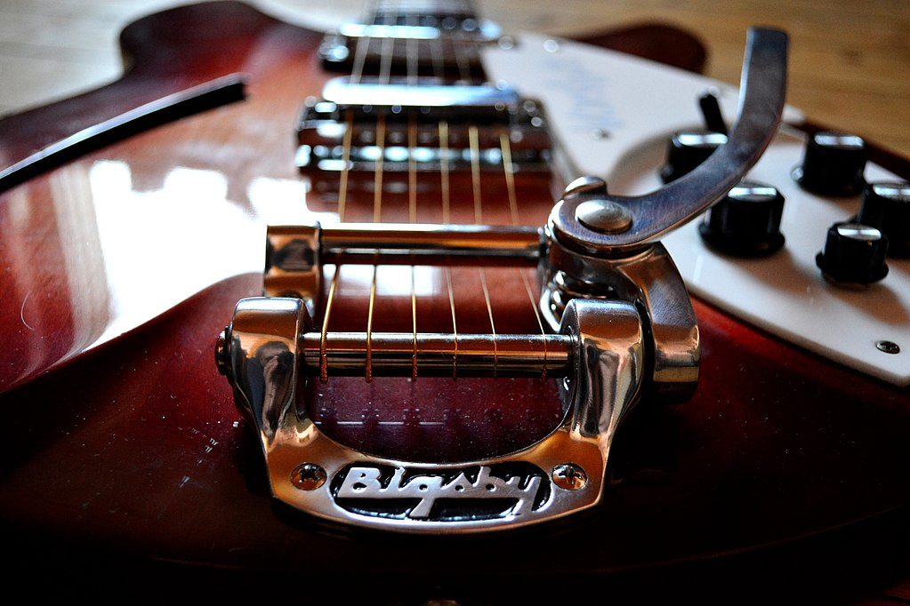
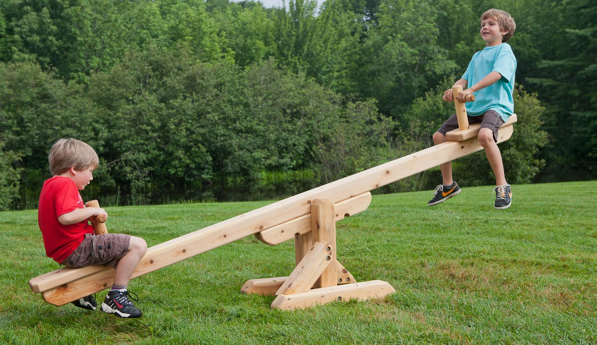

# foot-powered wah bass 

the bass is the coolest instrument, hands down. 

but what about a bass you can play with your foot? some people have built things like this:

<iframe width="560" height="315" src="https://www.youtube.com/embed/_aY6TxC1ojA" frameborder="0" allowfullscreen></iframe>

except in this case, the body is consciously forming the percussion. I want something where the body is subconsciously instigated in the sound production. Imagine a whammy bar: 

combined with one of these: 

