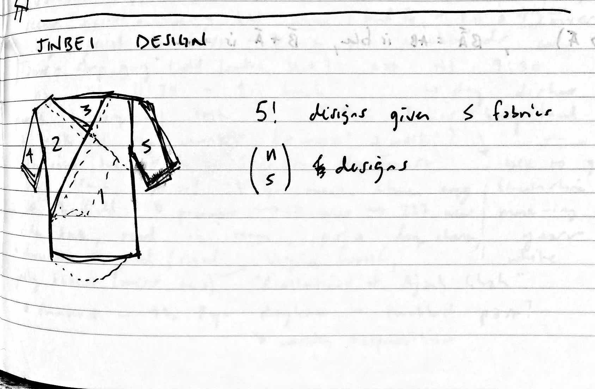

# modular clothing 

i've always thought of my clothing as objects that are part of me, that are friends of mine on my journey. every time I throw away a garment, i [snap a picture](https://oldthreadsrip.tumblr.com/) of it.

think about it: we carry these articles, each with a great deal of thought involved in their conception, close to our bodies for years in some cases. many of us spend a great deal of time thinking about our choice of clothes, as we will literally *live* with them. 

this concept is part of a shift in how we think about our clothing. instead of buying something that is mass-produced, we can let the consumer build their own personal style. of course, the tough part is finding a balance between uniqueness and combinatorial explosion. 

in a first instance, I am working on a design for a modified <a href="https://en.wikipedia.org/wiki/Jinbei" target="_blank">jinbei</a> where the pieces can be swapped and traded to create a garment that is both functional and an expressive outlet. 

in the future, I don't want to go clothes shopping, I want to own reconfigurable textile material that can be reshaped depending on my mood, my context, and my taste in the moment.  