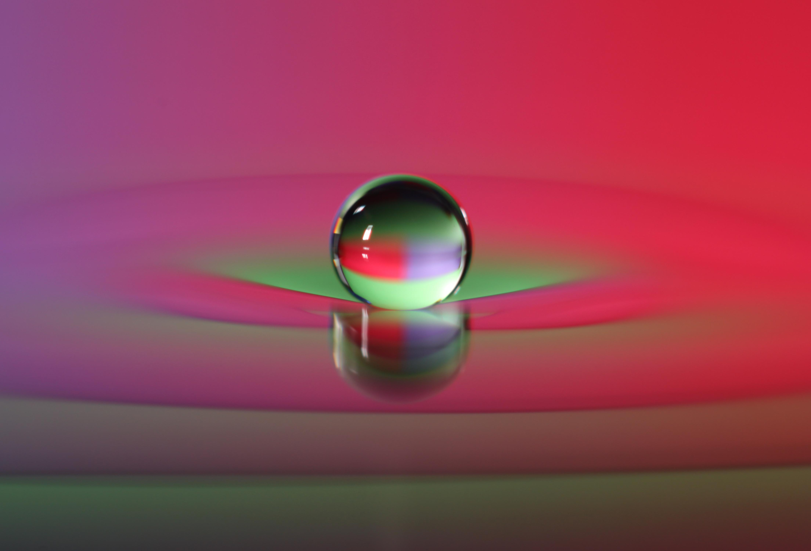

# droplet metronome

in my flat in London, I have an ongoing feud with my kitchen faucet. not only is a drip a terrible waste of water (i estimate that at the current rate, the drip alone is consuming roughly 40L of water a day!!!)

 (image from <a href="http://math.mit.edu/~bush/?page_id=484">john bush's lab</a> at mit)

that said, wouldn't it be cool to make a metronome out of the sound? i thought a bit about how to modulate the intensity of the sound, and i think it has to do with the surface on which the droplet is falling. perhaps there is a tensioner rod that modulates the rigidity of the surface, or even the rigidity of a container in which the drop falls. or you could put a speaker on it. that would work. 

obviously the tempo is modulated by the flow rate, that would just come down to converting flow rate to bpm. keep in mind it would also be a hecka-cool fountain, albeit slightly annoying. let's make it! 

actually, there is a [crazy video](https://www.youtube.com/watch?v=5kY8jXjpF1E) on youtube of a similar prototype... 